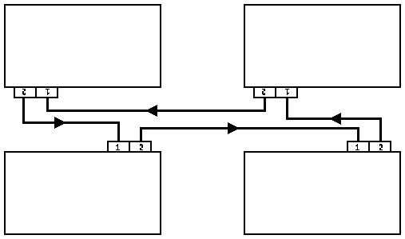

# CAN BUS - Test

19/04/2022
## Configurazione ad anello
Configurazione:  
  
Porta 1: RX  
Porta 2: TX  

[>> DEMO VIDEO 1 <<](https://www.youtube.com/watch?v=X3Ao-fzE2yc ">> DEMO VIDEO 1 <<")  
[>> DEMO VIDEO 2 <<](https://www.youtube.com/watch?v=fmzs-KFtZm0 ">> DEMO VIDEO 2 <<")  

Pulsante INT0: Connessione alla rete ad anello (assegnazione ID)  
Joystick: Selezione dell'ID su cui inviare (joystick su/giù) e invio messaggio (joystick select)

Gestione messaggio verso ID non sulla rete: percorre interamente l'anello e viene scartato

## ----------------------------------------------------------------------------

06/04/2022

## Test video [01] - Test funzionamento delle comunicazioni
DEMO: verifica della trasmissione di dati di dimensione arbitraria (16 blocchi da 8 byte), verifica della corretta propagazione dei messaggi  
[>> YouTube demo video <<](https://www.youtube.com/watch?v=o5lLoL9SIAE ">> YouTube demo video <<")  
Configurazione schede (vd. video)
Il file sample.c deve essere modificato in CAN_receiveBuffers(...) e CAN_transmitBuffers(...) nel ciclo while per far corrispondere i collegamenti.
```
D    A

C    B
```

```
CAN_1(A) <-> CAN_1(B)
CAN_2(A) <-> CAN_2(D)
CAN_2(B) <-> CAN_1(C)
CAN_2(C) <-> CAN_1(D)
```
(C impostato per non ricevere il messaggio, disabilitando CAN_receiveBuffers)

Premendo il pulsante INT-0 su C, il messaggio (124 byte) è passato da C a D direttamente, propagato da D ad A e da A a B  
```C -> D -> A -> B ```

## TODO:
1. Spostare gestione ricezione su CAN_IRQ per evitare busy waiting
1. Gestione collegamento nuove schede

## Interfaccia (a partire da KEIL LPC17xx)
L'interfaccia è realizzata a partire da quella fornita da KEIL ( ```\KEIL\ARM\Boards\Keil\MCB1700\CAN``` ) per LPC17xx.
Sono state modificate le funzioni dell'interfaccia per adattarle alla scheda Landtiger
Sono state aggiunte funzioni per trasmissione/ricezione di dati di dimensione arbitraria (>8 byte)


### CAN_transmitBuffer - __[NEW]__
Invio di un buffer di dati (max 8 byte) sulla porta CAN ctrl
```c
void CAN_transmitBuffer (uint32_t ctrl, void* buf, uint32_t len){
	uint32_t i, j;
	
	while(CAN_TxRdy[ctrl-1] == 0){};
	for (i = 0; i < len; i++){
		CAN_TxMsg[ctrl-1].data[i] = ((char*)buf)[i];	/*set msg to be sent*/
	}
	CAN_TxMsg[ctrl-1].len = len;
	CAN_TxRdy[ctrl-1] = 0;
	CAN_wrMsg(ctrl, &CAN_TxMsg[ctrl-1]);				/*write msg to tx buffer*/
}	
```


### CAN_transmitBuffers - __[NEW]__
Invio di un buffer di dati di dimensione arbitraria sulla porta CAN ctrl (vd. [Test Video](#Test-video)).
La trasmissione è effettuata come trasmissioni consecutive di blocchi da 8 byte a intervalli regolari (timer).
```c
void CAN_transmitBuffers(uint32_t ctrl, void* buf, uint32_t len){
	while(transmitting == 1){};     /*wait for timer0 transmission end - busy waiting, to be improved*/
	timer_buf = buf;                /*set timer0 transmission buffer*/
	timer_ctrl = ctrl;              /*set timer0 transmission channel*/
	timer_len = len;                /*set timer0 transmission buffer length*/
	timer_pos = 0;                  /*set timer0 transmission buffer position*/
	transmitting = 1;               /*activate timer0 tansmission*/
}
```

```c
void TIMER0_IRQHandler (void)
{
	if(timer_len > 0)
	{
		CAN_transmitBuffer(timer_ctrl, (char*)timer_buf+timer_pos*8, timer_len<8? timer_len:8);
		if(timer_len > 8)
			timer_len-=8;           /*next 8 bytes*/
		else
			timer_len=0;            /*empty buffer*/
		timer_pos+=1;               /*move to next data block (8 byte)*/
	}
	else
	{
		transmitting = 0;           /*set ready for next transmission*/
	}
  LPC_TIM0->IR = 1;			        /* clear interrupt flag */
  return;
}
```

### CAN_receiveBuffer - __[NEW]__
Ricezione di un buffer di dati (max 8 byte) sulla porta CAN ctrl
```c
void CAN_receiveBuffer (uint32_t ctrl, void* buf, uint32_t len){
	uint32_t i, j;
	
	while(CAN_RxRdy[ctrl-1] == 0){};                    /*wait for message received - busy waiting*/
    for (i = 0; i < CAN_RxMsg[ctrl-1].len; i++){
        ((char*)buf)[i] = CAN_RxMsg[ctrl-1].data[i];    /*copy message to buffer*/
    }
    CAN_RxRdy[ctrl-1] = 0;                             	/*reset ready flag*/
}	
```

### CAN_receiveBuffers - __[NEW]__
Ricezione di un buffer di dati di dimensione arbitraria sulla porta CAN ctrl. La porta in ricezione è in attesa sincrona.
```c
void CAN_receiveBuffers(uint32_t ctrl, void* buf, uint32_t len){
	uint32_t i, j;
	uint32_t nFrames = len/8 + (len%8 > 0? 1:0);			/*number of frames to receive*/
	i = len;
	for (j = 0; j < nFrames; j++){
		CAN_receiveBuffer(ctrl, (char*)buf+j*8, i<8? i:8);	/*receive frame*/
			i-=8;
	}
}
```

### CAN_setup - __[EDIT]__
Inizializzazione delle porte CAN.
Modificato (rispetto alla libreria base) per il corretto utilizzo dei pin della scheda landtiger

```c
void CAN_setup (uint32_t ctrl)  {
  LPC_CAN_TypeDef *pCAN = (ctrl == 1) ? LPC_CAN1 : LPC_CAN2;	/*Select CAN block*/

  if (ctrl == 1) {
    LPC_SC->PCONP       |=  (1	<<	13);						/* Enable power to CAN1 block */
    
	LPC_PINCON->PINSEL0 |=  (1	<<	0);           				/* Pin P0.0 used as RD1 (CAN1) */
    LPC_PINCON->PINSEL0 |=  (1	<<	2);         				/* Pin P0.1 used as TD1 (CAN1) */

    NVIC_EnableIRQ(CAN_IRQn);                    				/*Enable CAN interrupt */
  } 
  else {
    LPC_SC->PCONP       |=  (1	<<	14);           				/* Enable power to CAN2 block */
		
	LPC_PINCON->PINSEL0 |=  (1	<<	9);           				/* Pin P0.4 used as RD2 (CAN2) */
	LPC_PINCON->PINSEL0 |=  (1	<<	11);           				/* Pin P0.5 used as RD2 (CAN2) */
    
    NVIC_EnableIRQ(CAN_IRQn);                    				/* Enable CAN interrupt */
  }

  LPC_CANAF->AFMR = 2;                           				/* By default filter is not used */
  pCAN->MOD   = 1;                               				/* Enter reset mode */
  pCAN->IER   = 0;                               				/* Disable all interrupts */
  pCAN->GSR   = 0;                               				/* Clear status register */
  CAN_cfgBaudrate(ctrl, 500000);                 				/* Set bit timing */
  pCAN->IER   = 0x0003;                          				/* Enable Tx and Rx interrupt */
}
```
